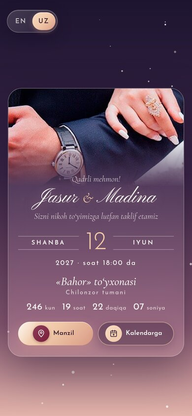

# Taklifnoma — to'y taklifnomasi shabloni

**🔗 Live demo:** https://taklifnoma-demo.netlify.app

Nikoh to'yi uchun ikki xil taklifnoma:

1. **Web taklifnoma** (`web/`): bitta sahifali sayt. Konvert ochiladi, musiqa chaladi, qor yog'adi. Unda sanagacha qolgan vaqt, xarita va kalendar tugmalari bor. O'zbek va ingliz tillarida ishlaydi (asosiy til o'zbekcha), telefonga moslangan va scroll qilmaydi.
2. **Rasm taklifnoma** (`image/`): chop etish uchun 300 dpi JPG. Joylashuv QR kod qilib qo'yilgan.

Hozir ichida namuna ma'lumotlar turibdi: *Jasur & Madina, 12-iyun 2027, «Bahor» to'yxonasi*.

| Web (telefon) | Rasm |
|---|---|
|  |  |

---

## 1. Web taklifnoma

```
web/
├── index.html      # matnlar (sukut bo'yicha inglizcha), meta-teglar
├── script.js       # to'y sanasi, xarita, qo'shiq, o'zbekcha/inglizcha tarjimalar
├── style.css
├── netlify.toml
├── img/            # couple.jpg, og.jpg (havola rasmi), ikonkalar
└── music/          # snowman.mp3 (Sia — Snowman)
```

**O'zgartirish kerak bo'lgan joylar:**

- `script.js`
  - `WEDDING`: to'y boshlanish va tugash vaqti, nomi, manzili, xarita havolasi (`mapUrl`)
  - `SONG`: qo'shiq nomi, ijrochisi va fayl yo'li
  - `I18N.en` / `I18N.uz`: sahifadagi barcha matnlar ikki tilda
- `index.html`
  - `<h1 class="card__names">`: kelin-kuyov ismlari
  - `.seal`: konvert muhridagi bosh harflar
  - `href` xarita tugmasida, `og:url`, `og:image`, `canonical` (demo manzili o'rniga o'z saytingiz manzili)
- `img/couple.jpg`: o'zingizning suratingiz (taxminan 848×1060)
- `music/snowman.mp3`: qo'shiq. Boshqasini qo'ysangiz, `script.js` dagi `SONG` ni ham o'zgartiring. Fayl bo'lmasa, pleyer ko'rinmaydi.
- `img/og.jpg`: Telegram yoki WhatsApp'da havola yuborilganda chiqadigan rasm (1200×630)

**Kompyuterda ko'rish:**

```bash
cd web && python3 -m http.server 8000
# http://localhost:8000
```

**Netlify'ga joylash:** `web` papkasini https://app.netlify.com/drop sahifasiga sudrab tashlang.

## 2. Rasm taklifnoma

```bash
pip install pillow numpy qrcode
cd image
# make.py ichidagi CONFIG qismini tahrirlang (ismlar, sana, manzil, MAP_URL)
python3 make.py
```

Natijada `taklifnoma.jpg` (2551×3579, 300 dpi) va kichik `preview.jpg` chiqadi.

## Manbalar

- Surat: [Pixabay](https://pixabay.com/photos/de-la-boda-pareja-el-amor-1255520/)
- Shriftlar (SIL OFL): Great Vibes, Cormorant Garamond, Montserrat (rasm uchun); Pinyon Script, Josefin Sans, Cormorant Garamond (web uchun, Google Fonts orqali)
